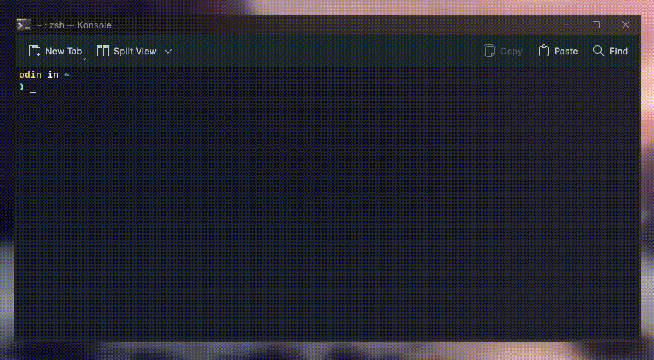

# Repository Updating Tool


## Overview

The Update Repo Tool is a command-line utility designed to simplify the process of updating multiple Git repositories in one go. It recursively searches for Git repositories within a specified directory and performs a `git pull` operation on each repository, keeping them up to date.




## Features

- Search for Git repositories recursively in a specified directory.
- Display progress while updating repositories.
- Customizable Git binary path.
- Caches the location of the git repositories so that it can run faster, unless the cache has been cleared.
- Color-coded output for better visibility.

## Table of Contents

- [Installation](#installation)
- [Usage](#usage)

## Installation

1. Clone this repository:

   ```bash
   git clone https://github.com/yourusername/updatemyrepos.git
   ```
2. Run the following command
   ```bash
   cd updatemyrepos && chmod +x install.sh && ./install.sh
   ```

## Usage

```bash
updatemyrepos $HOME/Projects
```
